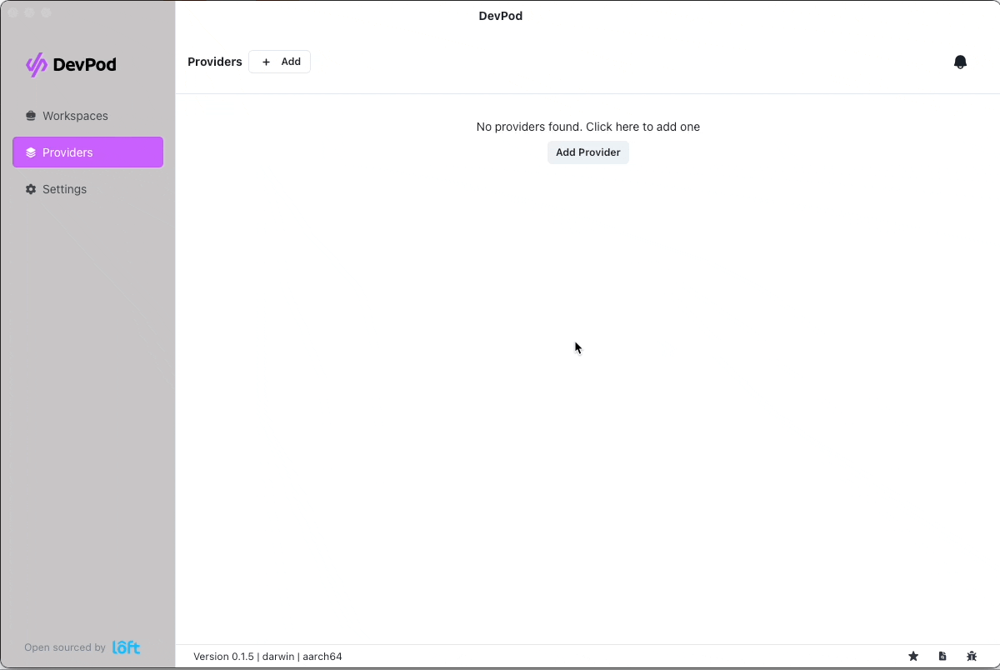

# OVHCloud provider for DevPod

The OVHCloud provider for [Loft Labs' DevPod](https://github.com/loft-sh/devpod).

**Note:** Even if I'm working for OVHCloud, this project is not supported by OVHcloud. I maintain it in my free time.

## Installation

### Using the cli

```
devpod provider add github.com/alexandrevilain/devpod-provider-ovhcloud
devpod provider use github.com/alexandrevilain/devpod-provider-ovhcloud
```

### Using the desktop app

Open DevPod app on your computer, then go to "Providers", then click on "+ Add" and add a custom provider.

Enter "github.com/alexandrevilain/devpod-provider-ovhcloud" as source:



## License

This project is licensed under the Mozilla Public License 2.0. See the [LICENSE](./LICENSE) file for more details.

## Contributions

Contributions are welcome! If you find any issues or want to add new features, please open an issue or submit a pull request on the GitHub repository.

## Disclaimer

This software is provided "as is" without warranty of any kind, express or implied. Use it at your own risk.
