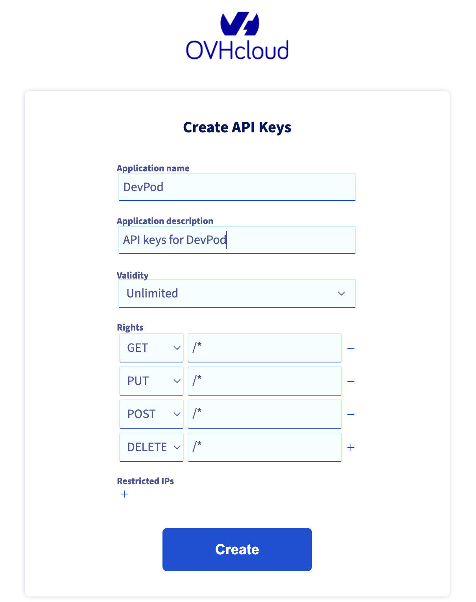
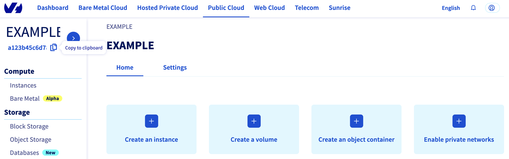

# OVHCloud provider for DevPod

The OVHCloud provider for [Loft Labs' DevPod](https://github.com/loft-sh/devpod).

**Note:** Even if I'm working for OVHCloud, this project is not supported by OVHcloud. I maintain it in my free time.

## Installation

### Using the CLI

```
devpod provider add github.com/alexandrevilain/devpod-provider-ovhcloud
devpod provider use github.com/alexandrevilain/devpod-provider-ovhcloud
```

### Pre-requisites

The OVHcloud provider needs to be configured with a set of information:

- an endpoint (please select one in the list according to your needs)
- an application key
- an application secret
- a consumer key
- a service name (the ID of your Public Cloud project)
- a region (the region to create the VM)
- a flavor (the machine type to use for the VM)

#### OVHcloud API keys

Behind the scenes, the OVHcloud DevPod provider is doing requests to OVHcloud APIs so that's the reason why you need to provide API keys.

To retrieve:

- an application key
- an application secret
- a consumer key

Please follow [First steps with the OVHcloud APIs](https://help.ovhcloud.com/csm/en-gb-api-getting-started-ovhcloud-api?id=kb_article_view&sysparm_article=KB0042784) tutorial.

Concretely, you have to generate these credentials via the [OVH token generation page](https://api.ovh.com/createToken/?GET=/*&POST=/*&PUT=/*&DELETE=/*&_gl=1*142pi5t*_gcl_au*NTc3NzAwNi4xNjg0NzQxODIy) with the following rights:



Note: you can change the validity period according to your needs.

When you have successfully generated your OVHcloud credentials, please keep them.

The last needed information is the `service name`: it is the ID of your Public Cloud project.

How to get it?

In the Public Cloud section, you can retrieve your service name ID thanks to the `Copy to clipboard` button.



### Using the desktop app

Open DevPod app on your computer, then go to "Providers" tab, then click on "Add Provider" button. Then in "Confgiure Provider" popup click on "+" button to add a custom provider.

Enter "github.com/alexandrevilain/devpod-provider-ovhcloud" or "alexandrevilain/devpod-provider-ovhcloud" as source and fill all the needed information:


## Usage

### Using the desktop app

Click on the `Workspaces` tab, then on the `Create Workspace` button and fill all the needed information.

## License

This project is licensed under the Mozilla Public License 2.0. See the [LICENSE](./LICENSE) file for more details.

## Contributions

Contributions are welcome! If you find any issues or want to add new features, please open an issue or submit a pull request on the GitHub repository.

## Disclaimer

This software is provided "as is" without warranty of any kind, express or implied. Use it at your own risk.
